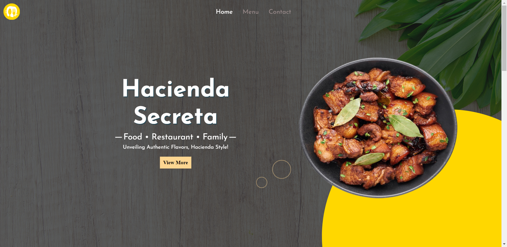
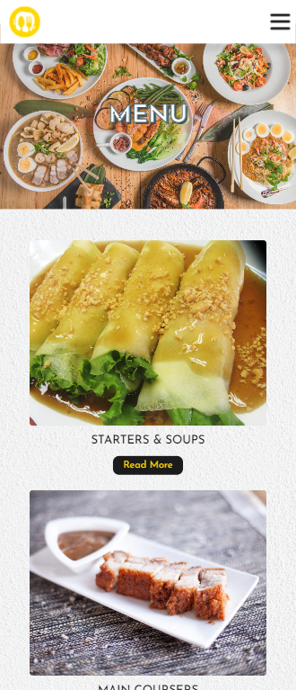

# RESTAURANT PAGE

This project is a non-webpack version of this [repository](https://github.com/rainierXcode/Restaurant-Page-Webpack) and is a responsive and accessible restaurant page featuring navigation tabs.

 ## :bulb: Features
 * **Responsive Design*Accessibility**
 * **Navigation Tabs**

 ## :computer: Tech Stack:
 * **HTML**
 * **JAVASCRIPT**
 * **CSS**
 * **WEBPACK**  

## Screenshots

